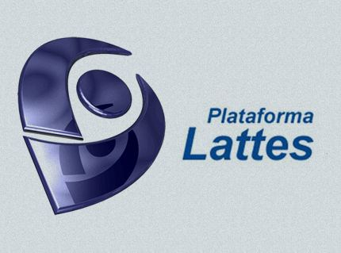

::: column-page

## Quem é o GPS

O Grupo de Pesquisa em Estatística Espacial (GPS) foi criado em 2015 pelos professores João Domingos Scalon, Renato Ribeiro de Lima e Marcelo Silva de Oliveira.  
Atualmente, o grupo é composto por vários membros.

### Pesquisadores e Assuntos

::: {.tabs}

### Pesquisadores
- João Domingos Scalon  [{width=22px}](http://lattes.cnpq.br/0962359014791482)  
- Renato Ribeiro de Lima  [{width=22px}](http://lattes.cnpq.br/7486689110603841)  
- Marcelo Silva de Oliveira  [{width=22px}](http://lattes.cnpq.br/1234567890123456)  

### Projetos
- Projeto 1: Estatística Espacial aplicada ao Meio Ambiente  
- Projeto 2: Modelagem de dados sociais  
- Projeto 3: Visualização interativa de mapas

### Contato
- GitHub: [GPS](https://github.com/gean-damaceno/GPS/commit/7de66ba110c0a4042e2d163cce8ed6cbc5afb1ed)  
- Email: geandamaceno030@gmail.com
:::

  { width=500px }

:::

