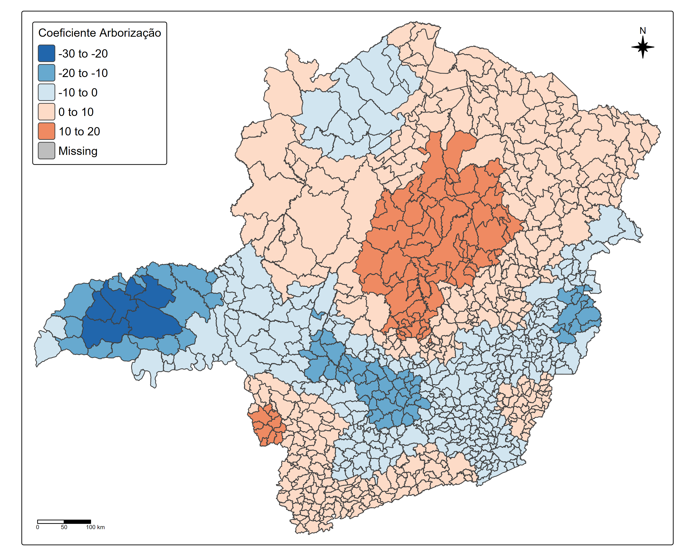
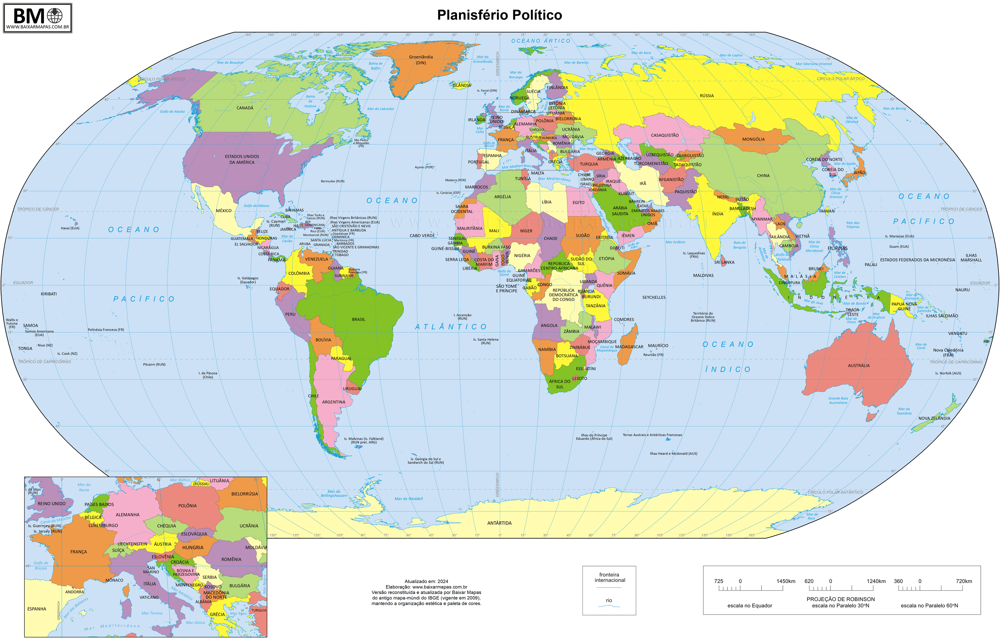
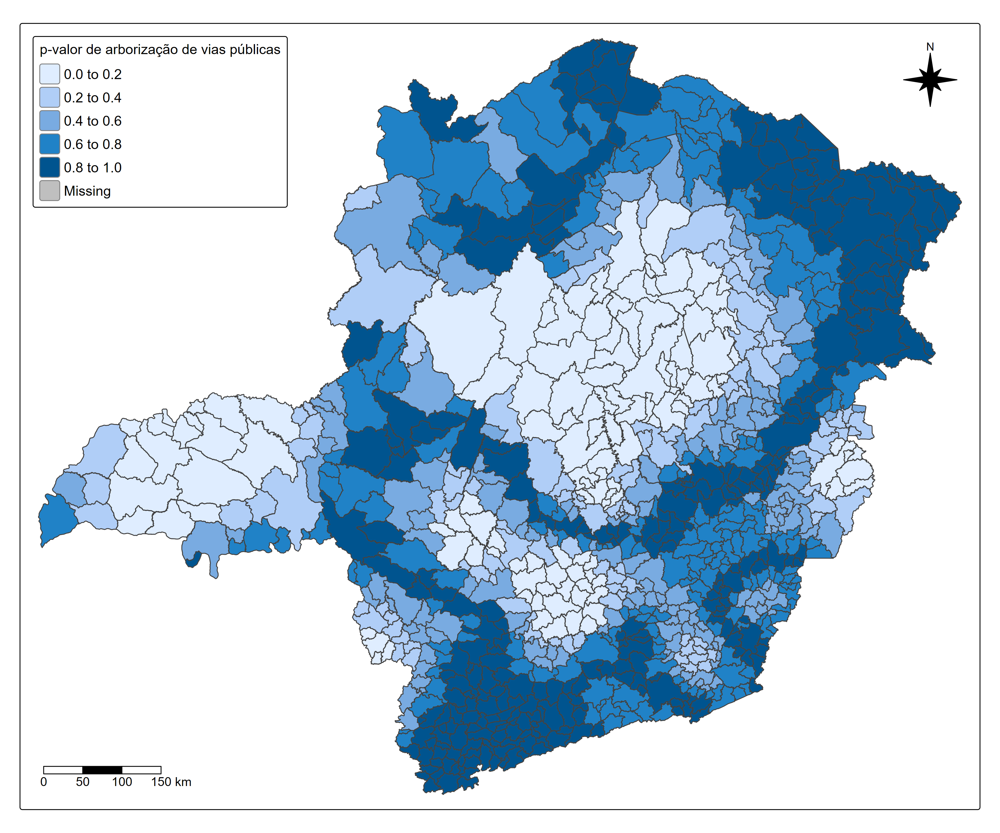
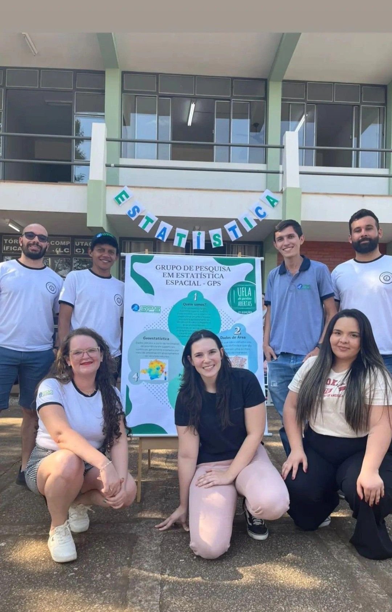
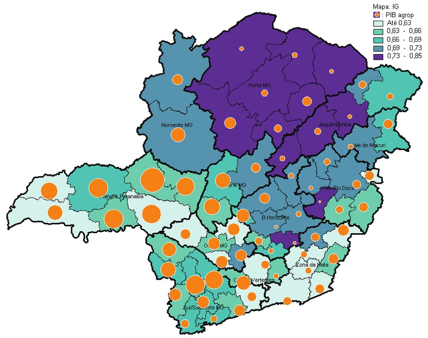
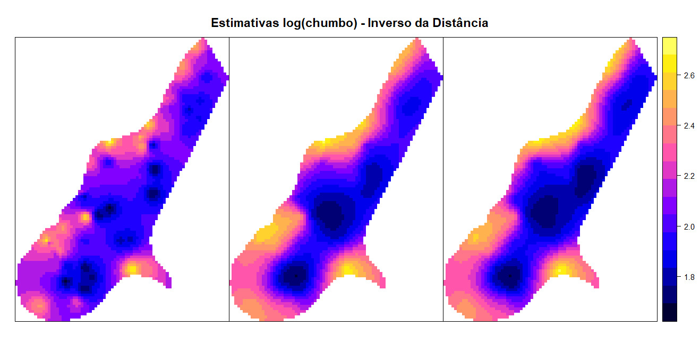
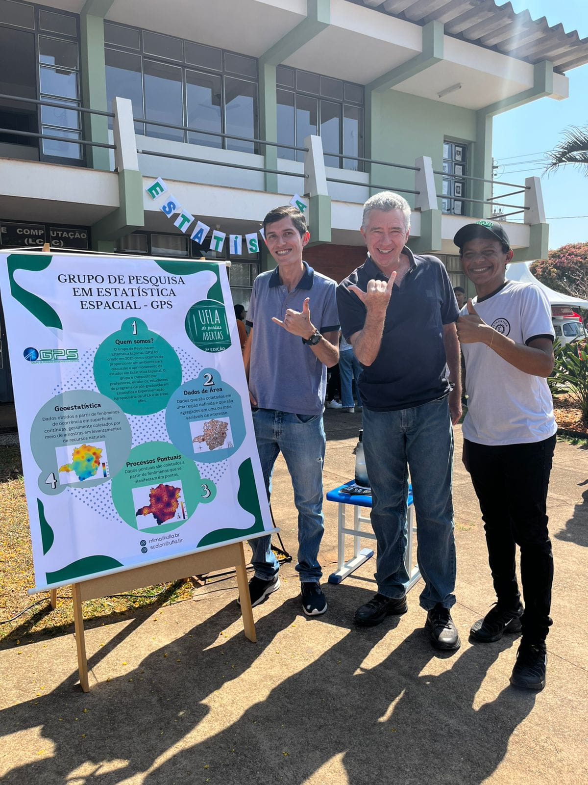
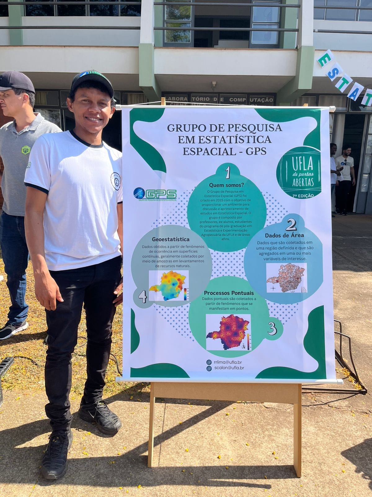

::: {.column-page}

## Quem é o GPS

O Grupo de Pesquisa em Estatística Espacial (GPS) foi criado em 2015 pelos professores João Domingos Scalon, Renato Ribeiro de Lima e Marcelo Silva de Oliveira.
Atualmente, o grupo é composto por professores, ex-alunos, pesquisadores externos, estudantes de pós-graduação e alunos de graduação, além de membros de diferentes áreas do conhecimento que se uniram ao GPS com o objetivo de aplicar e aprofundar técnicas de análise espacial.
O GPS tem como propósito promover apresentações e discussões de trabalhos entre seus integrantes, além de incentivar a produção e publicação de artigos científicos, criando um ambiente de integração, troca de experiências e aprimoramento científico, com o intuito de preparar os participantes para apresentações em eventos acadêmicos e contribuir para o avanço da pesquisa na área de estatística espacial.

```{=html}
<div class="carousel-container">
<div id="imageCarousel" class="carousel slide" data-bs-ride="carousel" data-bs-interval="3000">
  <div class="carousel-indicators">
    <button type="button" data-bs-target="#imageCarousel" data-bs-slide-to="0" class="active" aria-current="true" aria-label="Slide 1"></button>
    <button type="button" data-bs-target="#imageCarousel" data-bs-slide-to="1" aria-label="Slide 2"></button>
    <button type="button" data-bs-target="#imageCarousel" data-bs-slide-to="2" aria-label="Slide 3"></button>
    <button type="button" data-bs-target="#imageCarousel" data-bs-slide-to="3" aria-label="Slide 4"></button>
    <button type="button" data-bs-target="#imageCarousel" data-bs-slide-to="4" aria-label="Slide 5"></button>
    <button type="button" data-bs-target="#imageCarousel" data-bs-slide-to="5" aria-label="Slide 6"></button>
    <button type="button" data-bs-target="#imageCarousel" data-bs-slide-to="6" aria-label="Slide 7"></button>
    <button type="button" data-bs-target="#imageCarousel" data-bs-slide-to="7" aria-label="Slide 8"></button>
    <button type="button" data-bs-target="#imageCarousel" data-bs-slide-to="8" aria-label="Slide 9"></button>
    <button type="button" data-bs-target="#imageCarousel" data-bs-slide-to="9" aria-label="Slide 10"></button>
  </div>
  <div class="carousel-inner">
    <div class="carousel-item active">
      
    </div>
    <div class="carousel-item">
      
    </div>
    <div class="carousel-item">
      
    </div>
    <div class="carousel-item">
      
    </div>
    <div class="carousel-item">
      
    </div>
    <div class="carousel-item">
      
    </div>
    <div class="carousel-item">
      
    </div>
    <div class="carousel-item">
      
    </div>
    <div class="carousel-item">
      
    </div>
    <div class="carousel-item">
      
    </div>
  </div>
  <button class="carousel-control-prev" type="button" data-bs-target="#imageCarousel" data-bs-slide="prev">
    <span class="carousel-control-prev-icon" aria-hidden="true"></span>
    <span class="visually-hidden">Anterior</span>
  </button>
  <button class="carousel-control-next" type="button" data-bs-target="#imageCarousel" data-bs-slide="next">
    <span class="carousel-control-next-icon" aria-hidden="true"></span>
    <span class="visually-hidden">Próximo</span>
  </button>
</div>
</div>

<script>
// Garantir que o carrossel seja inicializado após o carregamento da página
document.addEventListener('DOMContentLoaded', function() {
  var carouselElement = document.querySelector('#imageCarousel');
  if (carouselElement) {
    var carousel = new bootstrap.Carousel(carouselElement, {
      interval: 3000,
      ride: 'carousel'
    });
  }
});
</script>
```


