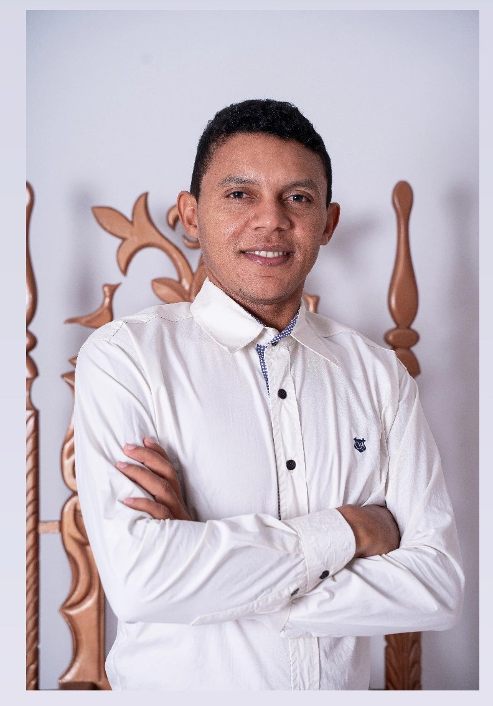
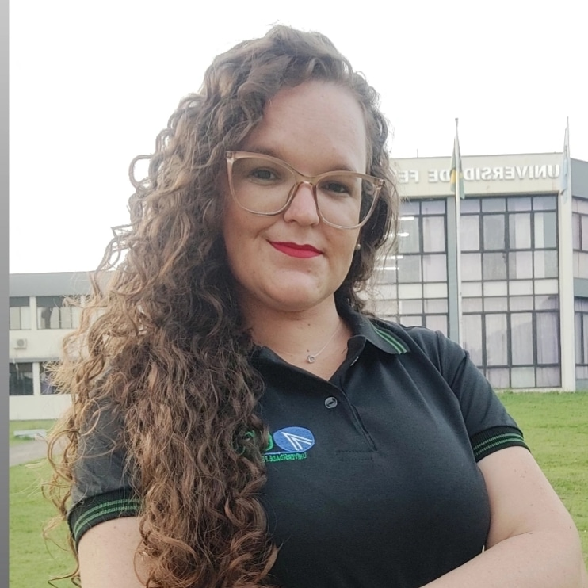
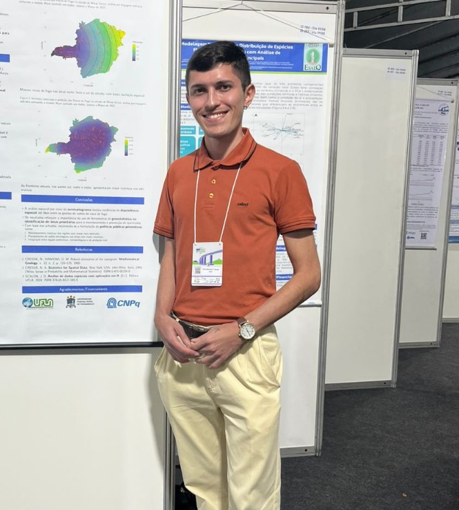
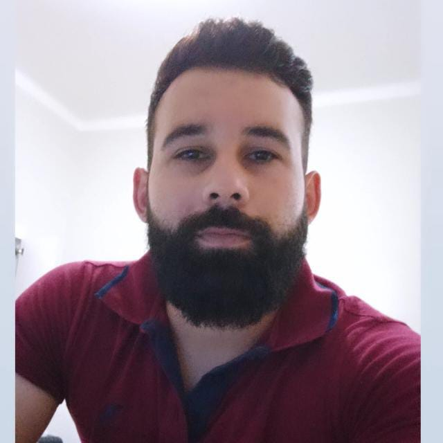

Nosso grupo é composto por varios membros na qual contribuem para a pesquisa.

## Membros

### Coordenadores

::: {.grid}
::: {.g-col-4}
{width="150px"}
:::
::: {.g-col-8}
**João Domingos Scalon** 

Graduado em Estatística pela Universidade Federal de São Carlos (1984), mestre em Engenharia Biomédica pela Universidade Federal do Rio de Janeiro (1993), PhD em Estatística pela Sheffield University (1997) e pós-doutor em Estatística pela Harvard University (2004) e Sheffield University (2015). Professor Titular do Departamento de Estatística, do Instituto de Ciências Exatas e Tecnológicas (ICET), da Universidade Federal de Lavras (UFLA) onde ministra aulas em nível de graduação e pós-graduação. Desenvolve pesquisas na área de Estatística Aplicada, com ênfase em Estatística Espacial. Autor do livro "Análise de dados espaciais com aplicações em R" (Finalista do prêmio Jabuti Acadêmico - 2025). Atualmente é o Diretor do ICET, Conselheiro do Conselho Universitário da UFLA e Co-Editor do Brazilian Journal of Biometrics.
:::
:::

---

::: {.grid}
::: {.g-col-4}
{width="150px"}
:::
::: {.g-col-8}

 **Renato Ribeiro de Lima** 

Possui graduação em Zootecnia pela Universidade Federal de Lavras (1993), mestrado em Genética e Melhoramento pela Universidade Federal de Viçosa (1997), doutorado em Estatística e Experimentação Agronômica pela Escola Superior de Agricultura Luiz de Queiroz (2005), com treinamento sanduíche na University of Kent at Canterbury, Inglaterra e pós-doutorado na University of Wisconsin, Madison, WI, Estados Unidos, em Estatística Genômica (2014). Bolsista produtividade (PQ/CNPq) desde 2015 e Professor Titular da Universidade Federal de Lavras. Orientador de Iniciação Científica e do Programa de Pós-Graduação em Estatística e Experimentação Agropecuária, do qual foi coordenador por 8 anos. Tem experiência na área de Probabilidade e Estatística, com ênfase em Probabilidade e Estatística Aplicadas, atuando principalmente nos seguintes temas: Estatística Espacial, Experimentação Agropecuária e Estatística Genômica.
:::
:::

---

### Secretário

::: {.grid}
::: {.g-col-4}
{width="150px"}
:::
::: {.g-col-8}
**Gean Pereira Damaceno**  |  |  

Gean possui formação em Licenciatura em Matemática e Técnico em Administração pelo Instituto Federal do Piauí, além de ser Mestre em Estatística e Experimentação Agropecuária pela Universidade Federal de Lavras (UFLA). Atualmente, cursa graduação em Estatística na mesma instituição.
No grupo de pesquisa, atua como secretário, sendo responsável pela organização e comunicação. Sua dissertação de mestrado teve como foco a análise de dados e estatística espacial, com modelagem robusta para outliers em casos de dengue em Minas Gerais.
É membro do GPS desde 2020. Fora da academia, seus hobbies incluem dançar forró, jogar futebol e praticar vaquejada. É um entusiasta da análise de dados, da estatística espacial e da programação.
:::
:::

---

### Subsecretária

::: {.grid}
::: {.g-col-4}
{width="150px"}
:::
::: {.g-col-8}

 **Yasmin Beatriz Pereira Santana** 

Yasmin possui formação em Licenciatura em Matemática (2020-2023) no Instituto Federal do Sul de  Minas e atualmente é Mestranda do Programa de Pós-Graduação em Estatística e Experimentação Agropecuária da Universidade Federal de Lavras (UFLA).
É membro ativo da comunidade PyLadies Lavras e integra o grupo GPS desde 2024.
Sua dissertação de mestrado está focada no desenvolvimento de um pacote na linguagem R para a implementação e análise dos modelos autoregressivos AR(1) e AR(1).
Sua pesquisa e atuação se concentram nas áreas de Estatística Experimental e Estatística Espacial.
:::
:::

---

::: {.grid}
::: {.g-col-4}
{width="150px"}
:::
::: {.g-col-8}

 **Marcelo Silva de Oliveira** 

Iniciou seus estudos universitários no curso de Engenharia Elétrica da Universidade Federal de Minas Gerais em 1979, graduou-se em Engenharia Agrícola pela Universidade Federal de Lavras em 1985, obteve o grau de mestre em Estatística pela Universidade Estadual de Campinas em 1991, e o grau de doutor em Engenharia pela Universidade de São Paulo em 2000. Desde 1986 dedicou-se principalmente a formação de pessoas, através do ensino em diversos cursos de graduação e de pós-graduação, e a pesquisa. Aposentou-se em 2018 como Professor Titular de Estatística da Universidade Federal de Lavras, porém
continua sua vida científica dedicando-se, ainda, a algumas de suas atividades anteriores, principalmente a pesquisa e a produção de livros, além de adicionar maior medida a outras atividades. Durante os 32 anos de docência na UFLA, lecionou presencialmente para 9.892 estudantes em todos os níveis do Ensino Superior, atuou presencialmente em 10.177 horas de aula presencial em sala-de-aula em todos os níveis
do Ensino Superior, orientou e coorientou 512 estudantes em todos os níveis do Ensino Superior, participou em 679 bancas acadêmicas examinadoras de estudantes em todos os níveis do Ensino Superior, publicou, até agora, 16 livros ou capítulos de livros didático-científicos, e 120 artigos em revistas
científicas. Também atuou em várias atividades de Pesquisa Científica (grupos de pesquisa, publicação científica, etc), foi Pesquisador-bolsista do CNPq por 11 anos, atuou em várias atividades de Extensão Universitária (consultorias, assessorias, palestras, etc) e em vários cargos de Gestão Universitária (Pró-
Reitorias, Diretorias, Coordenadorias, etc). Atualmente é docente-voluntário na Universidade Federal de Lavras, atuando principalmente no GPS – Grupo de Pesquisa em Estatística Espacial, e na Pós-Graduação em Estatística. Tem experiência nas áreas de Probabilidade e Estatística, e Gestão da Qualidade, atuando principalmente nos seguintes temas: Cálculo de Probabilidades, Inferência Estatística, Métodos
Estatísticos, Estatística Espacial, Geoestatística, Controle Estatístico da Qualidade, Gestão da Qualidade, Sistemas de Gestão da Qualidade. 

Marcelo é esposo de Nilma, pai de Hiel e Reuel, sogro de Fabiane e Rafaela, e avô de Joshua e Noah. Marcelo também é cristão bíblico, e crê firmemente em Jesus como seu Único e Suficiente Salvador e Senhor, congregando na Igreja Batista Central de Lavras.
:::
:::

---

::: {.grid}
::: {.g-col-4}
{width="150px"}
:::
::: {.g-col-8}
**Viviane Costa Silva**

Possui graduação em Estatística pela Universidade Estadual da Paraíba (UEPB) e mestrado em Estatística e Experimentação Agropecuária pela Universidade Federal de Lavras (UFLA). É membro dos grupos de pesquisa Análise e Modelagem Estatística (UEL), Estatística Aplicada e Computacional (UEPB) e Jovens Pesquisadores da RBRAS. Tem experiência na área de Estatística, com ênfase em modelos aditivos generalizados para localização, escala e forma (GAMLSS), além da aplicação de técnicas de Machine Learning em problemas de classificação e regressão. Atualmente, é doutoranda no Programa de Pós-Graduação em Estatística e Experimentação Agropecuária da UFLA, com linha de pesquisa em Análise de Regressão e atua como professora voluntária no Departamento de Estatística da mesma instituição.
:::
:::

---

::: {.grid}
::: {.g-col-4}
{width="150px"}
:::
::: {.g-col-8}
**Marcela Silva de Araujo**

Mestranda em Estatística e Experimentação Agropecuária pela Universidade Federal de Lavras (UFLA) e bacharela em Estatística pela Universidade Estadual da Paraíba (UEPB). Aluna de MBA em Data Science e Analytics pela ESALQ/USP. Integra o Grupo de Pesquisa em Estatística Espacial (GPS) e o Núcleo de Estudos em Séries Temporais da UFLA. Desenvolve pesquisas em Estatística Multivariada e Espacial, com aplicações em contextos educacionais, ambientais e de saúde pública. Coautora do sistema SISINFOENEM, registrado no INPI, voltado à exploração de dados educacionais com técnicas de ciência de dados e estatística aplicada. Possui experiência em iniciação científica, extensão, organização de eventos e apresentações em congressos. É membro dos Jovens Pesquisadores da RBRAS, integra a Comissão de Presidência do R-Ladies Lavras-MG e atua como Representante Discente no Conselho Departamental do DES/ICET-UFLA.
:::
:::

---

::: {.grid}
::: {.g-col-4}
{width="150px"}
:::
::: {.g-col-8}
**Elias Manensa Sabe**

Possui graduação em Ensino de Matemática pela Universidade Pedagógica (UP), MBA em Data Science e Analytics pela ESALQ-UP, mestrado em Estatística e Experimentação Agropecuária pela Universidade Federal de Lavras (UFLA). É membro dos grupos de pesquisa Análise e Modelagem Estatística (UEL) e Jovens Pesquisadores da RBRAS. Tem experiência na área de Estatística, com ênfase em modelos aditivos generalizados para localização, escala e forma (GAMLSS).  Atualmente, é doutorando no Programa de Pós-Graduação em Estatística e Experimentação Agropecuária da UFLA, com linha de pesquisa em Análise de Regressão.
:::
:::

---

::: {.grid}
::: {.g-col-4}
{width="150px"}
:::
::: {.g-col-8}
**Daví Barbosa Pereira de Sousa**

Mestrando em Estatística e Experimentação Agropecuária pela Universidade Federal de Lavras (UFLA), com ênfase em análise espacial. Atualmente trabalha com regressão espacial para dados de contagem com inflação de zeros. Aluno de MBA em Data Science e Analytics pela Escola Superior de Agricultura "Luiz de Queiroz", Universidade de São Paulo (ESALQ - USP). Graduado em Estatística pela Universidade Estadual da Paraíba (UEPB), onde atuou em projetos voltados à análise de dados econômicos e ambientais. Tem experiência com dados de saúde pública, geoprocessamento, e variáveis socioeconômicas e ambientais. Participa ativamente de congressos, workshops e eventos científicos. É membro da equipe "Comunicações e Redes Sociais" dos Jovens Pesquisadores da RBRAS, membro do Grupo de Pesquisa em Estatística Espacial - UFLA-MG, membro do Grupo de pesquisa em Estatística Espacial e Séries Temporais - UFLA-MG e tem interesse em aplicações da estatística voltadas para problemas reais, especialmente nas áreas de saúde, meio ambiente e políticas públicas.

Tem como passatempos o karatê, leitura e viagens.
:::
:::

---

::: {.grid}
::: {.g-col-4}
{width="150px"}
:::
::: {.g-col-8}
**Alex Monito Nhancololo**

A. M. Nhancololo is a Ph.D. student in Statistics and Probability at the Institute of Mathematics and Statistics, University of São Paulo (IME–USP). He holds an M.Sc. in Statistics and Agricultural Experimentation from the Federal University of Lavras (UFLA), where he received the Best Thesis Award (2024), and a Bachelor of Education in Mathematics with a specialization in Statistics from Universidade Save (Mozambique). He is also pursuing an M.Sc. in Financial Engineering at WorldQuant University and an MBA in Artificial Intelligence and Big Data at the Institute of Mathematical and Computer Sciences, University of São Paulo (ICMC–USP). He was awarded third place in the Spatial AI Challenge 2024 (I-GUIDE), together with Julian Huang and Yue Lin (University of Chicago). His primary research interests lie in spatio-temporal statistics and their applications to the social sciences, environmental studies, ecology, agriculture, and medicine. Methodologically, his work focuses on geospatial intelligence (GeoAI), machine learning, natural language processing, and deep learning, alongside spatial point processes, lattice/area data, geostatistics, and time-series analysis
:::
:::

---

::: {.grid}
::: {.g-col-4}
{width="150px"}
:::
::: {.g-col-8}
**Elpídio Ana Alberto**  

Possui licenciatura em Ensino de Agropecuária com Habilitação em Extensão Rural pela Universidade Pedagógica de Moçambique (2016) e é atualmente mestrando em Estatística e Experimentação Agropecuária na Universidade Federal de Lavras (UFLA). Desde 2019 atua como professor no Instituto Médio Santa Maria de Mocodoene, em Moçambique. Seus interesses de pesquisa concentram-se na análise espacial de dados agrícolas e experimentação agropecuária, com foco na variabilidade climática.
:::
:::  

---

::: {.grid}
::: {.g-col-4}
{width="150px"}
:::
::: {.g-col-8}
**Mateus Santos Peixoto**

Possui graduação em Estatística pela Universidade Estadual da Paraíba (UEPB, 2021). Foi membro do Centro Acadêmico de Estatística e da Empresa Júnior da UEPB (2019). É membro do Grupo de Pesquisa em Estatística Aplicada e Computacional da UEPB e do Centro de Pesquisa em Análise Preditiva, Analytics e Data Science da UEPB (desde 2019).
É mestre em Estatística e Experimentação Agropecuária pela Universidade Federal de Lavras (UFLA, 2022–2023), onde desenvolveu dissertação baseada em um modelo de regressão espacial Tobit aplicado aos casos de tuberculose em Minas Gerais, com foco em dados de área. É também membro do Grupo de Pesquisa em Estatística Espacial (GPS) da UFLA (desde 2022).
Atualmente, é doutorando em Estatística e Experimentação Agropecuária pela UFLA.
Desenvolve pesquisas na área de Estatística Aplicada, com ênfase em Estatística Espacial e estudos de saúde em dados georreferenciados. Participa ativamente de congressos, workshops e eventos científicos.
Tem como hobbies o judô, o jiu-jítsu, viagens, filmes, séries e tecnologia.

:::
:::

---

::: {.grid}
::: {.g-col-4}
{width="150px"}
:::
::: {.g-col-8}
**Wélson Antônio de Oliveira**

Graduado em Matemática (Licenciatura Plena) pela Universidade Federal de Lavras (UFLA), instituição onde também concluiu o Mestrado em Estatística e Experimentação Agropecuária. Possui doutorado em andamento no mesmo programa (PPGEE/ICET/UFLA), com interesse em métodos estatísticos aplicados, especialmente em estatística espacial, regressão espacial e modelagem de processos pontuais. Atualmente, está integrado junto ao Departamento de Formação Geral do CEFET-MG, Campus VII - Varginha, como professor substituto, ministrando disciplinas nas áreas de Matemática e Estatística.

:::
:::

---

